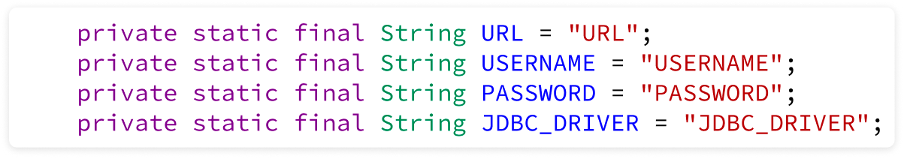

# 🚖 Taxi-service
This is a simple taxi service project.
We have a driver (as a user) cars and manufacturers

## ✍ **Available functionality**
- authentication / authorization
- login/logout
- create, delete, change cars
- create, delete, change manufacturer
- create, delete, change the driver

## 🎯 Models

## 👾 **Project structure:**
- Database ( MySql )
- DAO
- Service
- Controller
1) used to store information about models
2) DAO for each model of our project where we access the Database (MySQL) using sql queries, using both static and dynamic queries. In DAO we have CRUD methods
3) Used to execute the logical part of the project, accessing the database through the DAO level
4) Accepts a request from the client and generates a response

## 🤌 Steps required to get started:
- you need Tomcat version: 9.0.50 to run the project
- connectionUtil specify your data for working with the database
- the necessary tables for work can be found in init_db.sql
  
####  Fill in with your details 👇

 

## 🤖 Technologies
- Java 17
- Maven
- MySQL
- SQL
- JDBC
- Tomcat
- JSP
- JSTL
